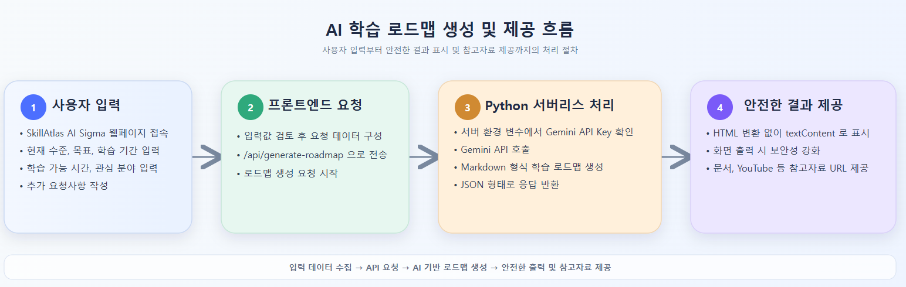
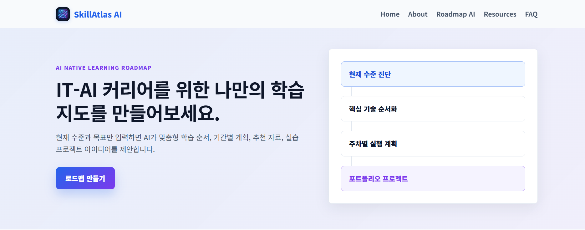
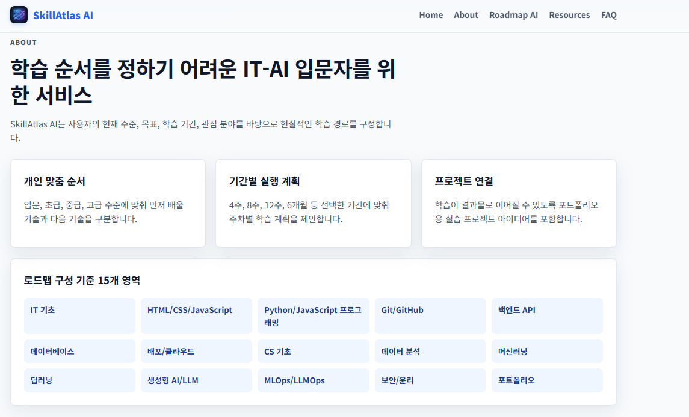
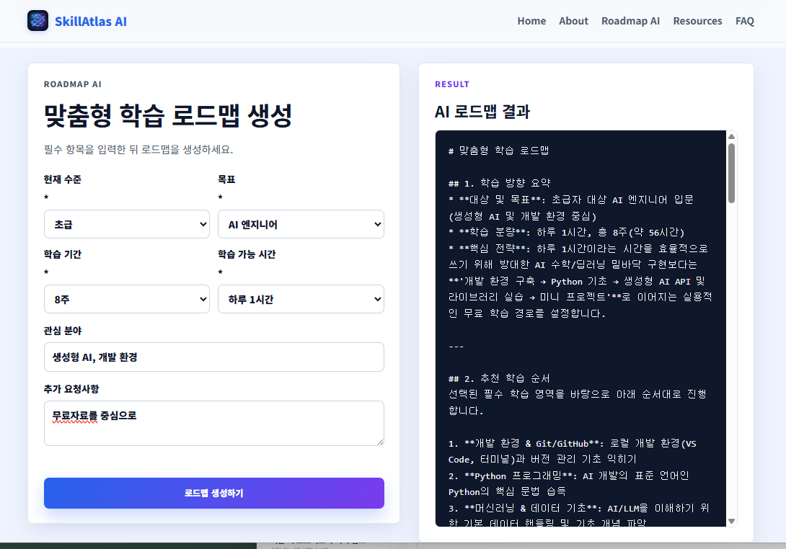
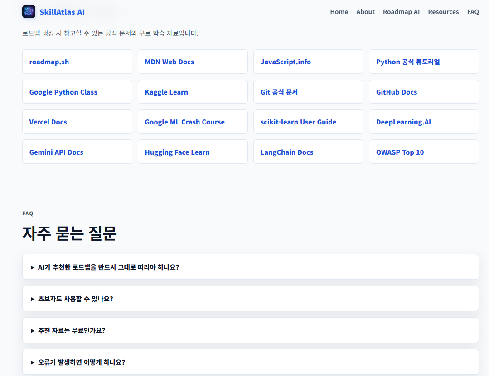
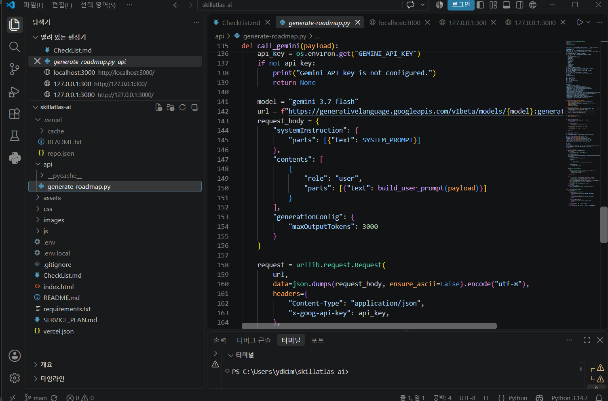

# Skillatlas 개발 완료보고서

IT/AI분야의 기술적 내용을 학습하고 싶어하는 사람들은 많으나 어디서부터 어떻게 해야 하는지 몰라 시대에 뒤처지는 느낌을 가진 사람들과 추가적 교육이 필요한 초급, 중급자 들에게 필요한 교육 방법과 참고자료를 제공해 주어 손쉽게 그들의 경험 수준을 제고하는데 일조 하기 위하여

사용자의 현재 수준, 목표, 학습 기간, 관심 분야를 바탕으로 IT-AI 맞춤형 학습 로드맵을 생성하는 AI 기반 웹서비스를 제작하게 되었습니다.

## 주요 기능

- 사용자 입력 기반 학습 로드맵 생성

- Gemini API를 활용한 맞춤형 추천

- 추천 학습 자료 URL 제공

- 실습 프로젝트 아이디어 제공

- 반응형 웹 UI

- 로딩, 입력 검증, 일반 오류 안내 처리

## 기술 스택

- HTML

- CSS

- JavaScript

- Python

- Vercel Serverless Functions

- Gemini API

## 배포 URL

- https://skillatlas-ai-sigma.vercel.app

## 기능 설명

사용자가 현재 수준, 목표, 학습 기간, 학습 가능 시간, 관심 분야, 추가 요청사항을 입력하면 프론트엔드가/api/generate-roadmap으로 요청을 보냅니다. Python 서버리스 함수는 서버 측 환경 변수로 Gemini API Key를 읽고 Gemini API를 호출한 뒤, Markdown 텍스트 형식의 학습 로드맵을 JSON으로 반환합니다.

AI 응답은 보안을 위해 HTML로 변환하지 않고textContent로 화면에 표시합니다.

## 환경 변수

Gemini API Key는 코드에 직접 작성하지 않고 서버 측 환경 변수로만 관리합니다.

- GEMINI_API_KEY=your_gemini_api_key

## 실행 스크린 샷

## AI코딩 도구 사용

## 서비스 기획서

      **  **SERVICE_PLAN 참조
